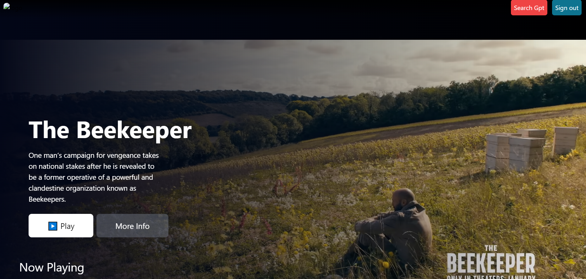
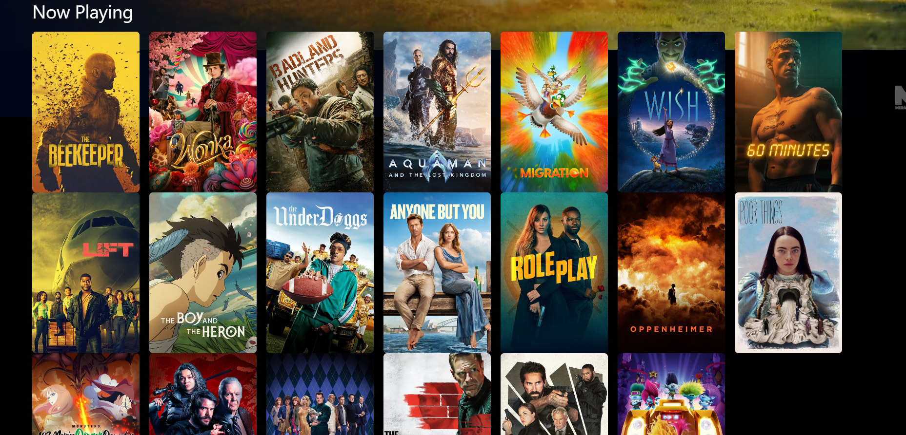
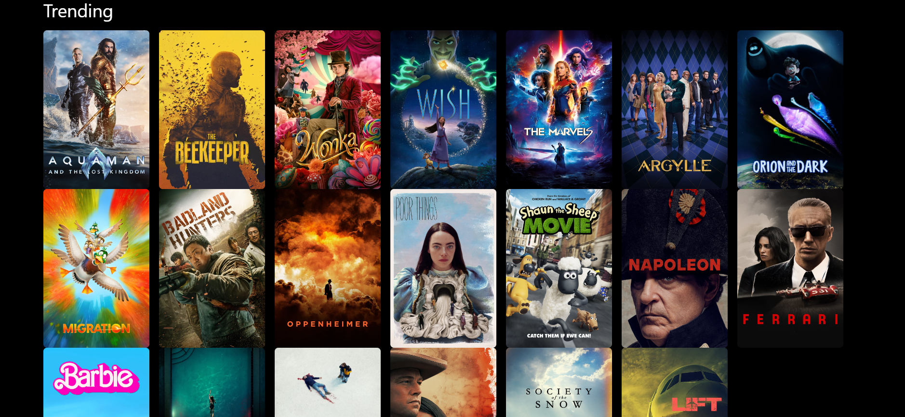
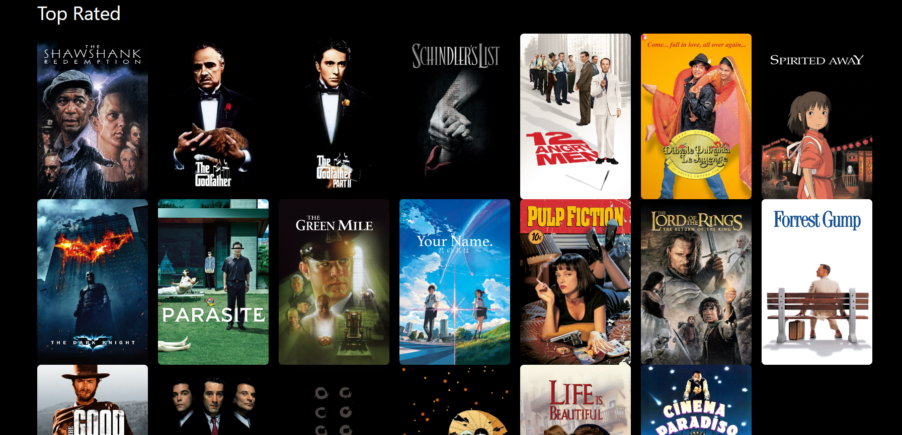
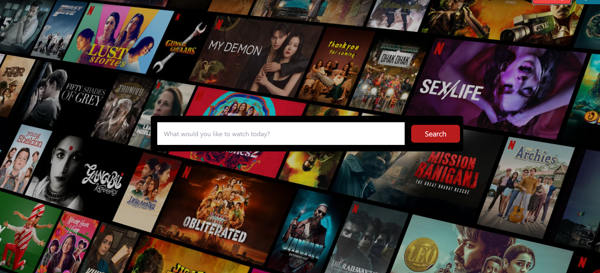
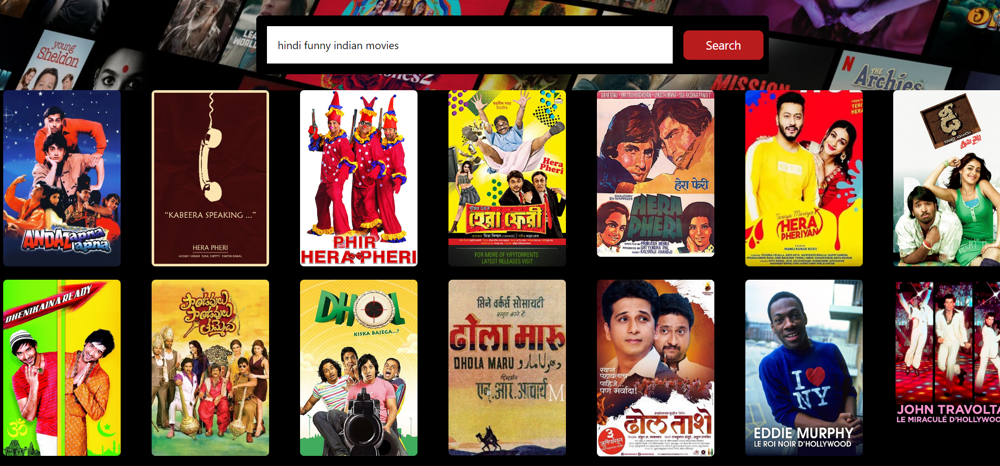
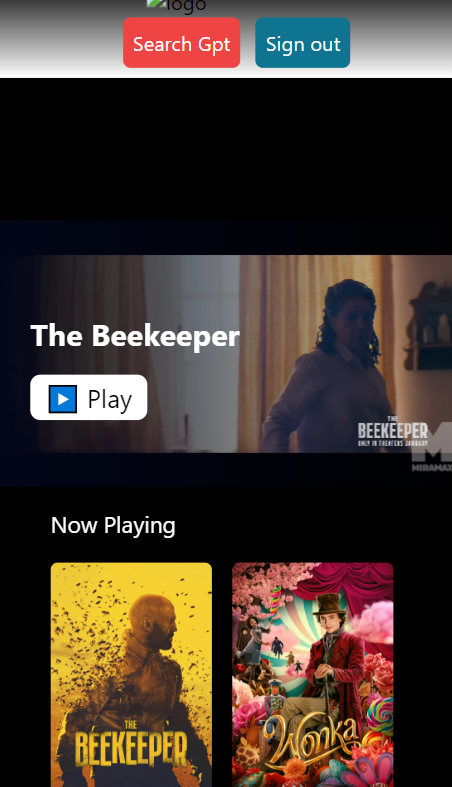
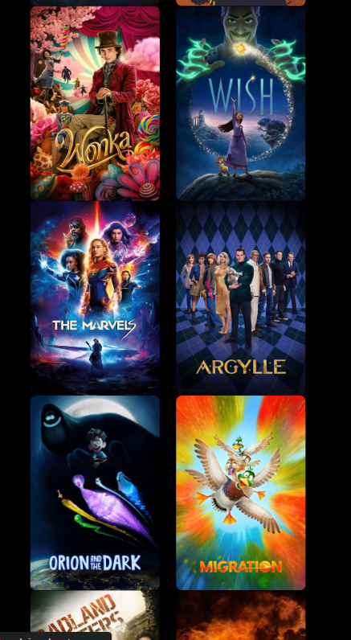
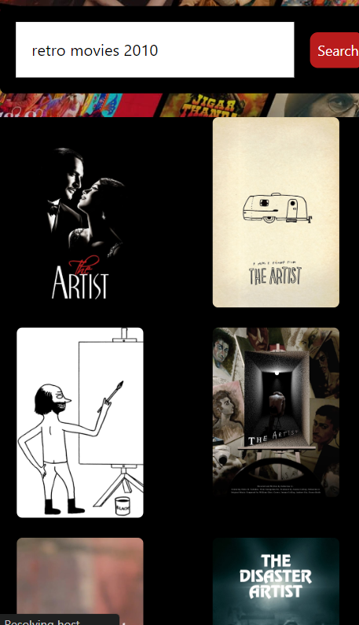

# MovieRecomadation App #
[project-live](https://gptmoviecinema.netlify.app/)
   - - - -
 # Technology used in this project #
  
  
  

  
  

   

   - - - - 
* Skill Gained in this project
  * In this project i learned how to manage big appliaction by using __Redux__ make redux store to passed the data at the centre location to diffrenent component using useslector and usedispatch 
  * Learned how routing work how to navigate from one route to another by performing some operation using
  __navigate__ 
 
  * Learned how to used the open ai to give the ai power to the aplication to give the user better __results__

  
  

 
 ## Destop view ##
 
  
 
 
 
 
 

 ## Moblie View
  
  
  
  
   